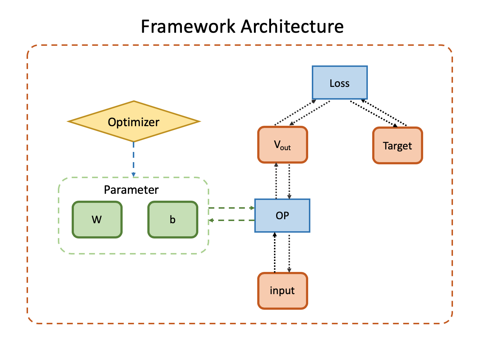

# pytensor: A Deep Learning Framework with pure numpy

pytensor is a deep learning framework implemented with pure numpy.


## Features

The framework is a toy framework implemented by pure numpy.

* It is a dynamic framework which graph can be re-constructed each time when computing forward.
* Users can use it to construct computational graph by connecting operations (as tensorflow and popular frameworks do)
* Auto differentiation is supported, so it is not necessary to implement backward computation by yourself
* Common operations used in NLP and speech is available such as embedding and lstm operations.  

## Install

To install From this repository (recommended):

	git clone https://github.com/xinjli/pytensor
	python setup.py install

This project is also on [pypi](https://pypi.python.org/pypi/pytensor>)

To install from pypi:

	pip install pytensor

## Tutorial

I implemented three models under the tutorial directory to show how to use the framework.
Each model will be introduced as well as the framework itself in my [blog](http://www.xinjianl.com)

### Linear Model
Here we show a predefined model described [here](http://www.xinjianl.com/blog/2017/12/20/implement-a-deep-learning-framework-with-pure-numpy/)


```python
from pytensor.tutorial.part2.linear import *
  
# load digit data for multiclass classification
data_train, data_test, label_train, label_test = digit_dataset()

# create a predefined linear model
# - input dimension: 64
# - target dimension: 10
model = Linear(64, 10)

# create a trainer for the model
trainer = Trainer(model)

# train 40 epoch
trainer.train(data_train, label_train, data_test, label_test, 40)
```

### Operations

Following operations are implemented currently or planned to become available

* Arithmetic operations
  * Addition
  * Multiply
  * Matmul

* Nonlinear operations
  * Relu
  * Sigmoid
  * Tanh
  
* Loss operations
  * Softmax CE Loss 
  * Square Loss

* MLP-related operations
  * Affine
  
* NLP-related operations
  * embedding
  * RNN
  * LSTM
  
* Speech-related operations
  * CTC (not included yet, prototype is available under the ctc branch)
  
### Tests

You can implement unit test to validate your model and operations are working.

Sample tests are available in pytensor.test. You can run those existing tests with following commands

 
	python -m pytensor.test.test_linear
	python -m pytensor.test.test_mlp
	python -m pytensor.test.test_rnn
	python -m pytensor.test.test_lstm


